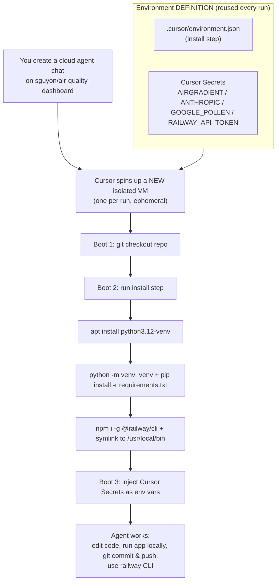
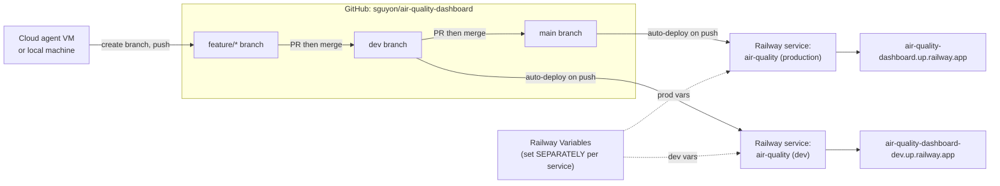

# Cloud Agent Architecture

Reference for how Cursor **cloud agents**, the **environment**, and the **Railway deployments** fit together for this repo (`sguyon/air-quality-dashboard`).

> Terminology note: "environment" is overloaded. There's the **Cursor cloud-agent VM** (where an agent runs) and the **Railway environments/services** (dev vs production, where the app is deployed). The two diagrams below separate them.

---

## 1. How a Cursor cloud agent environment boots

Every cloud agent runs on its own fresh, isolated VM. On boot Cursor checks out the repo, runs the install step from `.cursor/environment.json`, and injects secrets as env vars.

A new chat = a **new VM**, but it **reuses the same definition** (install step + secrets). It does not create a new environment each time.

---

## 2. How code reaches the live sites

Branching model is `feature/* -> dev -> main`. Railway auto-deploys on push to a connected branch.

| Branch | Railway service | URL | Purpose |
|--------|-----------------|-----|---------|
| `dev` | `air-quality (dev)` | https://air-quality-dashboard-dev.up.railway.app/ | Staging — integrate & test features |
| `main` | `air-quality (production)` | https://air-quality-dashboard.up.railway.app/ | Production (live) |

> The old `web-production-c9ff2.up.railway.app` domain is retired. Railway generated domains can change if a service is recreated — a custom domain avoids this.

---

## 3. The gotcha: two separate secret stores

They do **not** sync.

| Store | Injected into | Configured in | Used for |
|-------|---------------|---------------|----------|
| **Cursor Secrets** | the agent's VM | Cursor (Secrets panel) | the agent running/testing the app while developing |
| **Railway Variables** | the deployed app | Railway dashboard, **per service** (dev vs prod) | the live app at runtime |

Adding a key to Cursor Secrets or the Railway **dev** service does **not** add it to Railway **production**. (This is exactly why the prod Pollen card was empty until `GOOGLE_POLLEN_API_KEY` was added to the production service specifically.)

---

## 4. `.cursor/environment.json`

The repo-managed environment definition. Its `install` step is idempotent and runs on each build/refresh:

1. `sudo apt-get install -y python3.12-venv` — **required**: the build base image does not ship it, and `python -m venv` fails without it (`ensurepip is not available`).
2. `python3 -m venv .venv` + `pip install -r requirements.txt` — the app's Python deps.
3. `npm i -g @railway/cli` + symlink to `/usr/local/bin/railway` — puts the Railway CLI on `PATH` for every agent shell.

`set -e` makes real failures surface; the Railway-CLI steps are best-effort (`|| true`) so a CLI hiccup can't break environment creation.

To validate changes to this file, trigger a draft environment build off a branch that contains it and read the build logs (a build can report SUCCEEDED even if a masked step failed — always check the logs).

---

## 5. Using the Railway CLI from a cloud agent

- **Deploys don't need the CLI** — Railway auto-deploys on git push (`dev` -> dev service, `main` -> production). Agents just push/merge.
- The CLI is for **inspection/management**: `railway status`, `railway logs`, `railway variables`, redeploys.
- **Auth**: set a valid **account** token (from https://railway.com/account/tokens — a long opaque string, not a UUID/ID) in the `RAILWAY_API_TOKEN` Cursor Secret. Verify with `railway whoami`.
- Without a valid token, an agent can only authenticate for the current session via `railway login --browserless` (device-code flow; does not persist to future runs).

---

## Quick reference

| Task | How |
|------|-----|
| Run app locally (in an agent) | `.venv/bin/python server.py` → http://localhost:5555 |
| Check Railway auth | `railway whoami` |
| Inspect a service | `railway status` / `railway logs` |
| Deploy to staging | merge to `dev` (auto-deploys dev URL) |
| Deploy to production | PR `dev -> main`, merge (auto-deploys prod URL) |
| Validate `environment.json` | trigger a draft build off the branch, read build logs |
